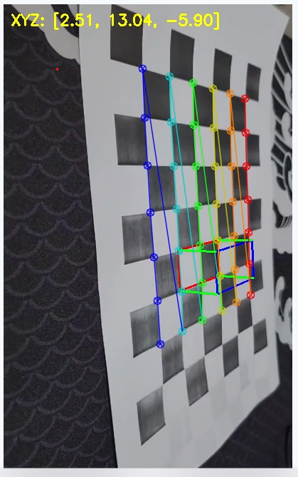

# Homework #4 - Camera Pose Estimation and AR

## 🎯 과제 목표
- **카메라 캘리브레이션 결과**를 바탕으로
- 체스보드 기반 **절대 카메라 자세(Camera Pose)** 를 추정하고
- **AR 물체(3D 도형 등)** 를 영상 위에 시각화한다

---

## 📸 사용 기술

- Python
- OpenCV (`cv2`)
- `cv.solvePnP()` : 카메라 포즈 추정
- `cv.projectPoints()` : 3D → 2D 투영
- `cv.findChessboardCorners()` : 체스보드 검출

---

## 🧱 AR 도형 설명
- 체스보드 위에 **3D 박스**(정육면체 형태) 생성
- **아랫면**은 빨강, **윗면**은 파랑, **모서리**는 초록선으로 연결
- 매 프레임마다 카메라의 위치(월드 좌표계 기준)도 출력

---

## 🖼️ 실행 결과 예시



- 체스보드 위에 박스가 렌더링됨
- 화면 왼쪽 상단에 카메라 위치 `XYZ: [x, y, z]` 표시됨

---

## ▶ 실행 방법

```bash
python pose_estimation_ar_video.py
